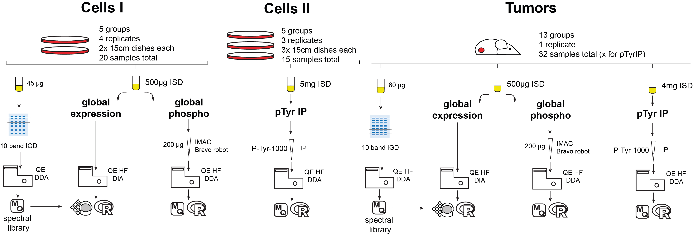

# Proteomics data analysis FGFR2 project Zingg et al.
R scripts used for the analysis of proteomic and phosphoproteomic data for the truncated FGFR2 is oncogene in cancer project of Zingg et al.

You will find the scripts for the analysis of cell and tumor data as well as outputs, results and overviews for sample names.

#### Overview of proteomics experiments

